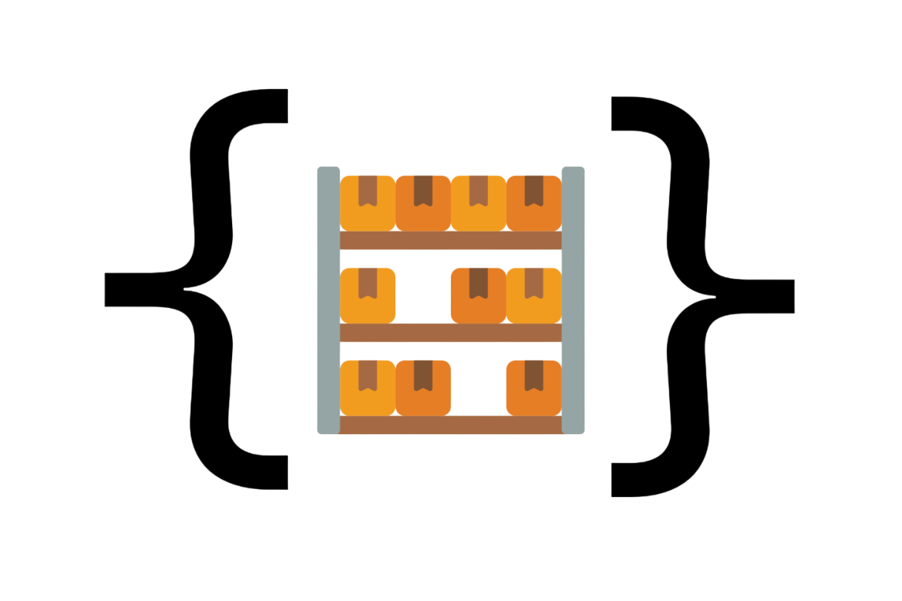
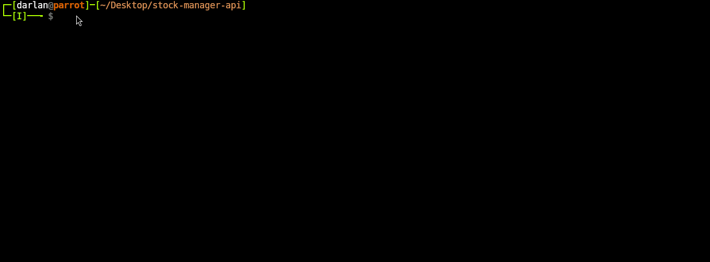

<h1 align="center">

  <br>
  StockManager API
</h1>

<div align="center">
  
[](#) 
[](#)
[](#) <br>
[](#)
[](#) <br>


</div>
<div align="center">

**StockManager** is a REST API for product inventory management.

The application allows users to create, update, delete, and retrieve products, <br>
as well as manage the available stock quantity.

The project was developed using TypeScript, structured with a layered architecture, <br>
and includes JWT-based authentication, standardized HTTP responses, Docker containerization, <br>
and a Shell script CLI to assist with environment setup and execution.

</div>

<details>
<summary><strong>Table of Contents 📜</strong></summary>

- [Demo 🎬](#demo-)
- [Features ✨](#features-)
- [Getting Started 🌱](#getting-started-)
  - [Prerequisites 📃](#prerequisites-)
  - [Installation 📥](#installation-)
- [Usage 🧭](#usage-)
  - [Full Setup 🚀](#full-setup-)
  - [Interactive Mode 📋](#interactive-mode-)
  - [Help 📖](#help-)
- [Built With 🔧](#built-with-)

</details>

## Demo 🎬

<div align="center">



</div>

## Features ✨

### API
* Product creation
* Product update
* Product deletion
* Retrieve a single product and list all products
* Stock quantity management
* User registration and authentication

### Security and Validation
* JWT-based authentication
* Data validation through domain entities
* Standardized HTTP responses
* Unit testing with Jest

### Infrastructure
* Full containerization with Docker
* API and database orchestration using Docker Compose
* Shell script CLI for environment setup

## Getting Started 🌱

Follow the steps below to run the project locally.

### Prerequisites 📃

Before you begin, make sure you have:

- **A Unix-like operating system** (Linux or macOS)
- **Docker** (with Docker Compose support))

To verify your installation, run:

```bash
docker --version
docker compose version
```
If Docker is not installed, follow the official installation guide [here](https://docs.docker.com/engine/install).

### Installation 📥
1. Clone the repository:
```bash
git clone https://github.com/DarlanLS2/stock-manager-api
```
2. Navigate to the project directory:
```bash
cd stock-manager-api
```
3. Make the CLI executable (if necessary):
```bash
chmod +x CLI.sh
```
4. Run the CLI:
```bash
./CLI.sh -f
```

The CLI will:
* Validate required environment variables
* Start the containers using Docker Compose
* Run the initial database seed

## Usage 🧭

### Full Setup 🚀

Rebuild containers from scratch and prepare everything:

```bash
./CLI.sh --full
```

This will:

* Remove existing containers and volumes
* Rebuild images
* Start the services
* Wait for database readiness
* Optionally insert initial data

### Interactive Mode 📋

Launch the interactive menu:

```bash
./CLI.sh --interactive
```

Available options:

* Full setup (rebuild containers and optionally insert seed data)
* Normal start (keep existing containers and data)
* Stop server and database
* Insert products into the database


### Help 📖

Display available options:

```bash
./CLI.sh --help
```

## Built With 🔧

[](#)
[](#)
[](#)
[](#)
[](#)
[](#) <br>
[](#)
[](#)
[](#)
[](#)
[](#)
[](#)
